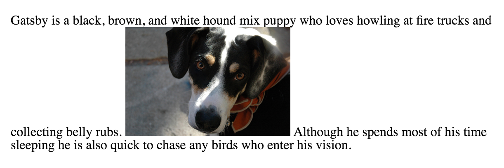

### Lesson 9
# Adding Media

We browse the Internet in search of interesting and informative content, which we usually find in the form of plain text. To accompany this plain text, HTML provides ways to embed rich media in the form of images, audio tracks, and videos, as well as to embed content from another web page in the form of an inline frame.

The ability to include images, audio tracks, videos, and inline frames within websites has been around for some time. Browser support for images and inline frames has generally been pretty good. And while the ability to add audio tracks and videos to a website has been around for years, the process has been fairly cumbersome. Fortunately, this process has improved and is much easier with support directly from HTML.

Today, we can freely use images, audio, video, and inline frames knowing that this content is supported across all major browsers.

###Adding Images
To add images to a page, we use the **img** inline element. The **img** element is a self-containing, or empty, element, which means that it doesn’t wrap any other content and it exists as a single tag. For the **img** element to work, a src attribute and value must be included to specify the source of the image. The src attribute value is a URL, typically relative to the server where a website is hosted.

In conjunction with the src attribute, the alt (alternative text) attribute, which describes the contents of an image, should be applied. The alt attribute value is picked up by search engines and assistive technologies to help convey the purpose of an image. The alt text will be displayed in place of the image if for some reason the image is not available.

```

```


###Sizing Images
It is important to identify the size of an image in order to tell the browser how large the image should be before the page even loads; thus the browser can reserve space for the image and render the page faster. There are a few different ways to size images so that they work well on a page. One option is to use the width and height attributes directly within the **img** tag in HTML.

Additionally, images may be sized using the width and height properties in CSS. When both the HTML attributes and CSS properties are used, the CSS attributes will take precedence over the HTML attributes.

Specifying either a width or height will cause the other dimension to adjust automatically to maintain the aspect ratio of the image. As an example, if we want an image to be 200 pixels tall but are less specifically concerned about how wide it is, we can set the height to 200 pixels, and the width of the image will adjust accordingly. Setting both a width and height will work also; however, doing so may break the aspect ratio of an image, causing it to appear distorted.

```
img {
  height: 200px;
  width: 200px;
}
```
While using the width and height attributes directly in HTML provides some semantic value by noting an image’s original size, it can be difficult to manage numerous images that all need to be the same size. In this event, it’s common practice to use CSS to resize the images.

###Positioning Images

We can use a number of different approaches to position images on a web page. By default images are positioned as inline-level elements; however, their positions may be changed using CSS, specifically the float, display, and box model properties, including padding, border, and margin.

###Inline Positioning Images

The **img** element is by default an inline-level element. Adding an image without any styles to a page will position that image within the same line as the content that surrounds it. Additionally, the height of the line in which an image appears will be changed to match the height of the image, which can create large vertical gaps within that line.

```
<p>Gatsby is a black, brown, and white hound mix puppy who loves howling at fire trucks and collecting belly rubs.  Although he spends most of his time sleeping he is also quick to chase any birds who enter his vision.</p>
```


Leaving images untouched in their default positioning isn’t too common. More often than not, images are displayed as block-level elements or are floated flush to one side.

###Block Positioning Images

Adding the display property to an image and setting its value to block forces the image to be a block-level element. This makes the image appear on its own line, allowing the surrounding content to be positioned above and below the image.

```
img {
  display: block;
}
```

### Positioning Images Flush Left or Right

Sometimes displaying an image as inline or block, or perhaps even inline-block, isn’t ideal. We may want the image to appear on the left or right side of its containing element, while all of the other content wraps around the image as necessary. To do this, we use the float property with a value of either left or right.

Remembering back to Lesson 5, “Positioning,” we recall that the float property was originally intended to position images to the left or right of a containing element. Now we’ll use it for that original purpose.

Floating an image is a start; however, all other content will align directly against it. To provide spacing around an image, we’ll use the margin property. Additionally, we can use the padding, border, and background properties to build a frame for the image, if desired.

```
img {
  background: #eaeaed;
  border: 1px solid #9799a7;
  float: right;
  margin: 8px 0 0 20px;
  padding: 4px;
}
```

### Adding Audio
HTML5 provides a quick and easy way to add audio files to a website by way of the **audio** element. As with the **img** element, the **audio** element accepts a source URL specified by the src attribute. Unlike the **img** element, though, the **audio** element requires both opening and closing tags, which we’ll discuss soon.

```
<audio src="jazz.ogg"></audio>
```


###Audio Attributes

Several other attributes may accompany the src attribute on the **audio** element; the most popular include autoplay, controls, loop, and preload.

The autoplay, controls, and loop attributes are all Boolean attributes. As Boolean attributes, they don’t require a stated value. Instead, when each is present on the **audio** element its value will be set to true, and the **audio** element will behave accordingly.

By default, the **audio** element isn’t displayed on a page. If the autoplay Boolean attribute is present on the **audio** element, nothing will appear on the page, but the audio file will automatically play upon loading.

```
<audio src="jazz.ogg" autoplay></audio>
```

To display the **audio** element on a page, the controls Boolean attribute is necessary. When it’s applied to the **audio** element, the controls Boolean attribute will display a browser’s default audio controls, including play and pause, seek, and volume controls.

```
<audio src="jazz.ogg" controls></audio>
```

When present on the **audio** element, the loop Boolean attribute will cause an audio file to repeat continually, from beginning to end.

Lastly, the preload attribute for the **audio** element helps identify what, if any, information about the audio file should be loaded before the clip is played. It accepts three values: none, auto, and metadata. The none value won’t preload any information about an audio file, while the auto value will preload all information about an audio file. The metadata value sits in between the none and auto values, as it will preload any available metadata information about an audio file, such as the clip’s length, but not all information.

When the preload attribute isn’t present on the **audio** element, all information about an audio file is loaded, as if the value was set to auto. For this reason, using the preload attribute with a value of metadata or none is a good idea when an audio file is not essential to a page. It’ll help to conserve bandwidth and allow pages to load faster.

### Audio Fallbacks & Multiple Sources

At the moment, different browsers support different audio file formats, the three most popular of which are ogg, mp3, and wav. For the best browser support we’ll need to use a handful of audio fallbacks, which will be included inside an **audio** element’s opening and closing tags.

To begin, we’ll remove the src attribute from the **audio** element. Instead, we’ll use the **source** element, with a src attribute, nested inside the **audio** element to define a new source.

Using a **source** element and src attribute for each file format, we can list one audio file format after the other. We’ll use the type attribute to quickly help the browser identify which audio types are available. When a browser recognizes an audio file format it will load that file and ignore all the others.

Because it was introduced in HTML5, some browsers may not support the **audio** element. In this case, we can provide a link to download the audio file after any **source** elements within the **audio** element.

```
<audio controls>
  <source src="jazz.ogg" type="audio/ogg">
  <source src="jazz.mp3" type="audio/mpeg">
  <source src="jazz.wav" type="audio/wav">
  Please <a href="jazz.mp3" download>download</a> the audio file.
</audio>
```

To review the previous code, the **audio** element includes the controls Boolean attribute to ensure the audio player is displayed within browsers that support the element. The **audio** element does not include a src attribute and instead wraps three different **source** elements. Each **source** element includes a src attribute that references a different audio file format and a type attribute to identify the format of the audio file. As a last fallback, if a browser doesn’t recognize any of the audio file formats, the anchor link to download the element will be displayed.

In addition to the **audio** element, HTML5 also introduced the **video** element, which shares quite a few similarities with the **audio** element.

### Adding Video
Adding video in HTML5 is very similar to adding audio. We use the **video** element in place of the **audio** element. All of the same attributes (src, autoplay, controls, loop, and preload) and fallbacks apply here, too.

With the **audio** element, if the controls Boolean attribute isn’t specified the audio clip isn’t displayed. With videos, if the controls Boolean attribute is not specified the video will display. However, it is fairly difficult to view unless the autoplay Boolean attribute is also applied. In general, the best practice here is to include the controls Boolean attribute unless there is a good reason not to allow users to start, stop, or replay the video.

Since videos take up space on the page, it doesn’t hurt to specify their dimensions, which is most commonly done with width and height properties in CSS. This helps ensure that the video isn’t too large and stays within the implied layout of a page. Additionally, specifying a size, as with images, helps the browser render videos faster and allows it to allocate the proper space needed for the video to be displayed.

```
<video src="earth.ogv" controls></video>
```

###Poster Attribute

One additional attribute available for the **video** element is the poster attribute. The poster attribute allows us to specify an image, in the form of a URL, to be shown before a video is played. The example below uses a screen capture from the video as the poster for the Earth video.

```
<video src="earth.ogv" controls poster="earth-video-screenshot.jpg"></video>
```

### Video Fallbacks

As with the **audio** element, video fallbacks are also necessary. The same markup format, with multiple **source** elements for each file type and a plain text fallback, also applies within the **video** element.
```
<video controls>
  <source src="earth.ogv" type="video/ogg">
  <source src="earth.mp4" type="video/mp4">
  Please <a href="earth.mp4" download>download</a> the video.
</video>
```

One additional fallback option that could be used in place of a plain text fallback is to use a YouTube or Vimeo embedded video. These video hosting websites allow us to upload our videos, provide a standard video player, and enable us to embed our videos onto a page using an inline frame.

### Adding Inline Frames
Another way to add content to a page is to embed another HTML page within the current page. This is done using an inline frame, or **iframe** element. The **iframe** element accepts the URL of another HTML page within the src attribute value; this causes the content from the embedded HTML page to be displayed on the current page. The value of the src attribute may be a URL relative to the page the **iframe** element appears on or an absolute URL for an entirely external page.

Many pages use the **iframe** element to embed media onto a page from an external website such as Google Maps, YouTube, and others.

```
<iframe src="https://www.google.com/maps/embed?..."></iframe>
```

The **iframe** element has a few default styles, including an inset border and a width and height. These styles can be adjusted using the frameborder, width, and height HTML attributes or by using the border, width, and height CSS properties.

###Seamless Inline Frames

Pages referenced within the src attribute of an **iframe** element play by their own rules, as they do not inherit any styles or behaviors from the page they are referenced on. Any styles applied to a page that includes an **iframe** element will not be inherited by the page referenced within the **iframe** element. Additionally, links within the page referenced within the **iframe** element will open inside that frame, leaving the page that contains the **iframe** element unchanged.

There will be times when we’ll want to change these behaviors, and the seamless Boolean attribute will allow us to do just that. When present on the **iframe** element, the seamless Boolean attribute allows styles from the page that includes an **iframe** element to be inherited by the page referenced within the **iframe** element. Additionally, the seamless Boolean attribute allows links clicked on a page referenced within an **iframe** element to be opened within the same window as the original page that includes the **iframe** element.

```
<iframe src="contact.html" seamless></iframe>
```

The seamless Boolean attribute is a new attribute introduced in HTML5. Although the browser support for this attribute is growing, it will not work within older browsers. It’s advisable to test the seamless Boolean attribute before using it.

### Semantically Identifying Figures & Captions

With HTML5 also came the introduction of the **figure** and **figcaption** elements. These elements were created to semantically mark up self-contained content or media, commonly with a caption. Before HTML5 this was frequently done using an ordered list. While an ordered list worked, the markup was not semantically correct.

####Figure

The **figure** block-level element is used to identify and wrap self-contained content, often in the form of media. It may surround images, audio clips, videos, blocks of code, diagrams, illustrations, or other self-contained media. More than one item of self-contained content, such as multiple images or videos, may be contained within the **figure** element at a time. If the **figure** element is moved from the main portion of a page to another location (for example, the bottom of the page), it should not disrupt the content or legibility of the page.

```
<figure>
  
</figure>
```

#### Figure Caption

To add a caption or legend to the **figure** element, the **figcaption** element is used. The **figcaption** may appear at the top of, bottom of, or anywhere within the **figure** element; however, it may only appear once. When it’s used, the **figcaption** element will serve as the caption for all content within the **figure** element.

Additionally, the **figcaption** element may replace an **img** element’s alt attribute if the content of the **figcaption** element provides a useful description of the visual content of the image.

```
<figure>
  
  <figcaption>A beautiful black, brown, and white hound dog wearing kerchief.</figcaption>
</figure>
```

## Resources & Links
- [Using HTML5 audio and video](https://developer.mozilla.org/en-US/docs/Web/Guide/HTML/Using_HTML5_audio_and_video) via Mozilla Developer Network 
- [Audio HTML5 Element](https://developer.mozilla.org/en-US/docs/Web/HTML/Element/audio) via Mozilla Developer Network 
- [Introduction to HTML5 Video](http://dev.opera.com/articles/introduction-html5-video/) via Dev.Opera 
- [The figure & figcaption elements](http://html5doctor.com/the-figure-figcaption-elements/) via HTML5 Doctor

