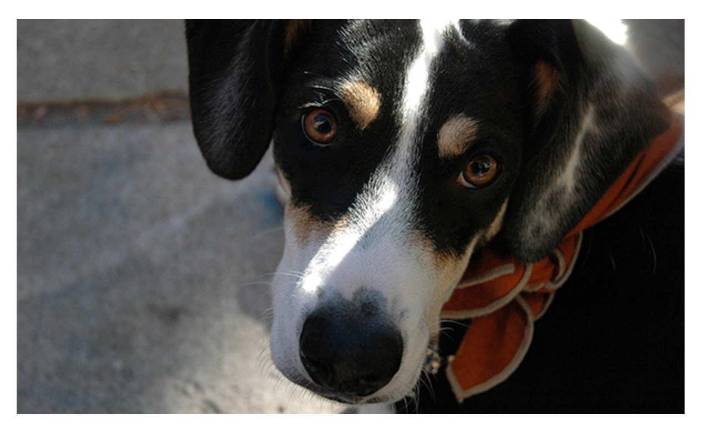

### Lesson 9
# Adding Media

We browse the Internet in search of interesting and informative content, which we usually find in the form of plain text. To accompany this plain text, HTML provides ways to embed rich media in the form of images, audio tracks, and videos, as well as to embed content from another web page in the form of an inline frame.

The ability to include images, audio tracks, videos, and inline frames within websites has been around for some time. Browser support for images and inline frames has generally been pretty good. And while the ability to add audio tracks and videos to a website has been around for years, the process has been fairly cumbersome. Fortunately, this process has improved and is much easier with support directly from HTML.

Today, we can freely use images, audio, video, and inline frames knowing that this content is supported across all major browsers.

###Adding Images
To add images to a page, we use the **img** inline element. The **img** element is a self-containing, or empty, element, which means that it doesn’t wrap any other content and it exists as a single tag. For the **img** element to work, a src attribute and value must be included to specify the source of the image. The src attribute value is a URL, typically relative to the server where a website is hosted.

In conjunction with the src attribute, the alt (alternative text) attribute, which describes the contents of an image, should be applied. The alt attribute value is picked up by search engines and assistive technologies to help convey the purpose of an image. The alt text will be displayed in place of the image if for some reason the image is not available.

```

```



###Sizing Images
It is important to identify the size of an image in order to tell the browser how large the image should be before the page even loads; thus the browser can reserve space for the image and render the page faster. There are a few different ways to size images so that they work well on a page. One option is to use the width and height attributes directly within the **img** tag in HTML.

Additionally, images may be sized using the width and height properties in CSS. When both the HTML attributes and CSS properties are used, the CSS attributes will take precedence over the HTML attributes.

Specifying either a width or height will cause the other dimension to adjust automatically to maintain the aspect ratio of the image. As an example, if we want an image to be 200 pixels tall but are less specifically concerned about how wide it is, we can set the height to 200 pixels, and the width of the image will adjust accordingly. Setting both a width and height will work also; however, doing so may break the aspect ratio of an image, causing it to appear distorted.

```
img {
  height: 200px;
  width: 200px;
}
```
While using the width and height attributes directly in HTML provides some semantic value by noting an image’s original size, it can be difficult to manage numerous images that all need to be the same size. In this event, it’s common practice to use CSS to resize the images.

###Positioning Images

We can use a number of different approaches to position images on a web page. By default images are positioned as inline-level elements; however, their positions may be changed using CSS, specifically the float, display, and box model properties, including padding, border, and margin.

###Inline Positioning Images

The **img** element is by default an inline-level element. Adding an image without any styles to a page will position that image within the same line as the content that surrounds it. Additionally, the height of the line in which an image appears will be changed to match the height of the image, which can create large vertical gaps within that line.

```
<p>Gatsby is a black, brown, and white hound mix puppy who loves howling at fire trucks and collecting belly rubs.  Although he spends most of his time sleeping he is also quick to chase any birds who enter his vision.</p>
```

