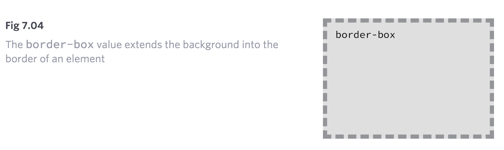
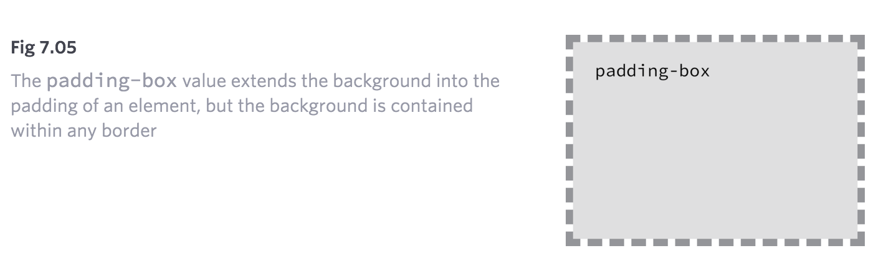
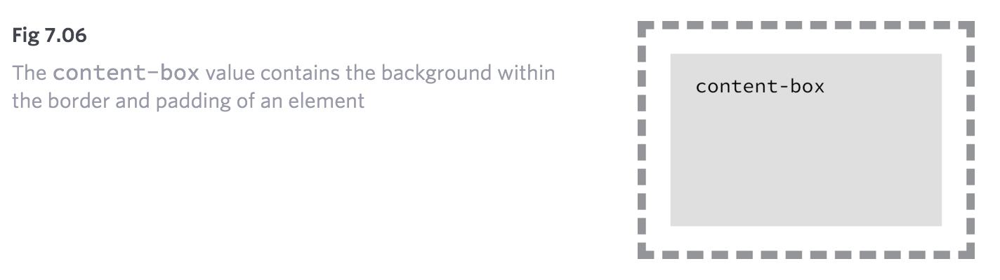

##Lesson 7

#Backgrounds and Gradients

Backgrounds have a significant impact on the design of a website. They help create a site’s look and feel, establish groupings, and assign priority, and they have a considerable influence on a website’s usability.

Within CSS, element backgrounds can be a solid color, an image, a gradient, or a combination of these. As we decide how to implement these backgrounds, we should keep in mind that every background contributes to the overall appearance of our website.

In this lesson we’re going to take a look at how to assign different types of backgrounds, including gradients, to elements; we’ll also play around with a handful of CSS3 properties specific to backgrounds.

### Adding a Background Color
The quickest way to add a background to an element is to add a single-color background using the background or background-color property. The background property accepts colors and images in shorthand form, while the background-color property is used strictly for setting solid background colors. Either property will work, and which one you decide to use depends on your preference as well as the case for which you’re using it.

```
div {
background-color: #b2b2b2;
}
```

When adding a background color, we have a few options for the values we can use. As with other color values, we can pick from keywords, hexadecimal codes, and RGB, RGBa, HSL, and HSLa values. Most commonly we’ll see hexadecimal values; however, we may occasionally want to use RGBa or HSLa values for transparencies.

### Transparent Backgrounds

When using an RGBa or HSLa value as a transparent background color, it’s a good idea to provide a fallback color, too, because not all browsers recognize RGBa or HSLa values. And when a browser comes across a value it doesn’t recognize, it will ignore it.

Fortunately, there is an easy way to provide a fallback background. CSS cascades from the top of a file to the bottom of a file; thus, we can use two background-color properties within a single rule set. The first background-color property will use a “safe” background color, such as a hexadecimal value, and the second background-color property will use an RGBa or HSLa value. Here, if a browser understands the RGBa or HSLa value it will render it, and if it doesn’t, it will fall back to the hexadecimal value above it.

```
div {
  background-color: #b2b2b2;
  background-color: rgba(0, 0, 0, .3);
}
```

###Adding a Background Image
Besides adding a background color to an element, we can also add a background image. Background images work similarly to background colors; however, they offer a few additional properties to finesse the images. As before, we can use the background property with a shorthand value, or we can use the background-image property outright. No matter which property we use, there must be an image source identified using a url() function.

The url() function value will be the background image’s path, and the familiar rules for creating hyperlink paths apply here. Keep an eye out for different directories, and be sure to show exactly where the image resides. The path will be placed inside parentheses and quoted.

```
div {
  background-image: url("alert.png");
}
```

Adding a background image solely using a url value can provide undesirable results, as by default the background image will repeat horizontally and vertically from the top left of the given element to fill up the element’s background. Thankfully we can use the background-repeat and background-position properties to control how or even whether the image repeats.

###Background Repeat
By default, a background image will repeat indefinitely, both vertically and horizontally, unless otherwise specified. The background-repeat property may be used to change the direction in which a background image is repeated, if repeated at all.

```
div {
  background-image: url("alert.png");
  background-repeat: no-repeat;
}
```

The background-repeat property accepts four different values: repeat, repeat-x, repeat-y, and no-repeat. The repeat value is the default value and will repeat a background image both vertically and horizontally.

The repeat-x value will repeat the background image horizontally, while the repeat-y value will repeat the background image vertically. Lastly, the no-repeat value will tell the browser to display the background image once—that is, do not repeat it at all.


###Background Position
By default, background images are positioned at the left top corner of an element. However, by using the background-position property, we can control exactly where the background image is placed relative to that corner.

```
div {
  background-image: url("alert.png");
  background-position: 20px 10px;
  background-repeat: no-repeat;
}
```

The background-position property requires two values: a horizontal offset (the first value) and a vertical offset (the second value). If only one value is specified, that value is used for the horizontal offset and the vertical offset will default to 50%.

Because we’re moving the background image from the left top corner of the element, length values specifically will be in relation to that corner.

To set a background-position value, we can use the top, right, bottom, left, and center keywords, pixels, percentages, or any length measurement. Keywords and percentages work very similarly. The keyword value left top is identical to the percentage value 0 0, which will keep an image positioned at the left top corner of the element. The keyword value right bottom is identical to the percentage value 100% 100%, which will position an image in the right bottom corner of the element.  Using pixels for a background-position value is also common, as pixels give us precise control over where our background will be positioned.

### Shorthand Background Image Values
The background-color, background-image, background-position, and background-repeat properties may be rolled up into a shorthand value for the background property alone. The order of these properties as a shorthand background property value may vary, however it commonly falls as background-color, background-image, background-position, and then background-repeat.

```
div {
  background: #b2b2b2 url("alert.png") 20px 10px no-repeat;
}
```

### Background Image Example

In the following example, we’ll use the background property with a shorthand value that includes background-color, background-image, background-position, and background-repeat values.

Please take note that there is both a relative value and an absolute value within the background-position value. The first value, 20 pixels, is the horizontal value, positioning the background-image 20 pixels from the left of the element. The second value, 50%, is the vertical value, which vertically centers the background-image.

A few other properties and values are also included within the notice-success class rule set to further style the alert message.

HTML
```
<div class="notice-success">
  Woo hoo! Congratulations, you did it!
</div>
```

CSS
```
.notice-success {
  background: #67b11c url("tick.png") 20px 50% no-repeat;
  border: 2px solid #467813;
  border-radius: 5px;
  color: #fff;
  font-family: "Helvetica Neue", Helvetica, Arial, sans-serif;
  padding: 15px 20px 15px 50px;
}
```


## Designing Gradient Backgrounds
Gradient backgrounds were introduced with CSS3, and designers and front-end developers everywhere rejoiced. Although gradient backgrounds do not work in legacy browsers, they are supported by all modern browsers.

Within CSS, gradient backgrounds are treated as background images. We can create a gradient using the background or background-image properties, just like a regular background image. The property value for a gradient background varies depending on what type of gradient we’d like, linear or radial.

###Gradient Background Vendor Prefixes

In Lesson 4, “The Box Model,” we discussed adding vendor prefixes to new CSS properties or values so that browsers can support recently developed CSS features. Gradient background values were one of the values that required the use of vendor prefixes. Fortunately, most browsers have since eliminated the need for a vendor prefix in order to render a gradient background; however, it is still worth outlining vendor prefixes to ensure the best support.

At first, as we begin discussing linear gradient backgrounds, we’ll include each of the different vendor prefixes. After that, in the interest of brevity, we’ll omit the different prefixes as we continue to discuss gradient backgrounds, including radial gradient backgrounds.

###Linear Gradient Background

For years designers and developers have been cutting up gradient image files, created using image-processing software, and using them as linear gradient backgrounds on elements. The process worked, but it took a while to implement and was very inflexible. Fortunately those days are gone, and linear gradient backgrounds can now be specified within CSS. If a color needs changing, there is no need to reproduce and recut an image and upload it to the server. Now all we need to do is change a quick value within CSS. Beautiful.

```
div {
  background: #466368;
  background: -webkit-linear-gradient(#648880, #293f50);
  background:    -moz-linear-gradient(#648880, #293f50);
  background:         linear-gradient(#648880, #293f50);
}
```

Linear gradients are identified by using the linear-gradient() function within the background or background-image property. The linear-gradient() function must include two color values, the first of which will be the beginning color value and the second of which will be the ending color value. The browser will then handle the transition between the two colors.

Before any gradient backgrounds are identified, we’ll also put in a default background property with a solid color. The solid color is to be used as a fallback should a browser not support gradient backgrounds.


####Changing the Direction of a Gradient Background
By default, linear gradient backgrounds move from the top to the bottom of an element, transitioning smoothly between the first color value and the second. This direction, however, may be changed with the use of keywords or a degree value stated before any color values.

For example, should we want a gradient to move from the left of an element to the right, we can use the keyword value to right to identify the direction in which the linear gradient should progress. Keyword values may also be combined. If we want the gradient to move from the left top to the right bottom of an element, we can use the keyword value of to right bottom.

```
div {
  background: #466368;
  background: linear-gradient(to right bottom, #648880, #293f50);
}
```

When we use a diagonal gradient on an element that isn’t exactly square, the background gradient will not proceed directly from one corner to the other. Instead, the gradient will identify the absolute center of the element, place anchors in the perpendicular corners from where it should progress, and then move to the general direction of the corner stated within the value. These corners the gradient moves towards are called “magic corners,” as they are not absolute. Eric Meyer has done a wonderful job of outlining this syntax in his article “[Linear Gradient Keywords](http://meyerweb.com/eric/thoughts/2012/04/26/lineargradient-keywords/)”.

Besides keywords, degree values are also acceptable. If we want our gradient to move to the left top of an element, we can use the degree value of 315deg, or if we want our gradient to move to the right bottom of an element, we can use the degree value of 135deg. This same concept can be applied for any degree value, 0 through 360.

###Radial Gradient Background

While the linear gradient is perfect for a gradient moving from one direction to another, often the need for a radial gradient arises. Radial background gradients work just like linear gradients and share many of the same values. For radial gradients, instead of using the linear-gradient() function within the background or background-image property, we’ll use the radial-gradient() function.

```
div {
  background: #466368;
  background: radial-gradient(#648880, #293f50);
}
```
Radial gradients work from the inside to the outside of an element. Thus, the first color identified within the radial-gradient() function will sit in the absolute center of the element, and the second color will sit on the outside of an element. The browser will then create the transition between the two colors.

One of the primary differences between radial gradients and linear gradients is that radial gradients can be quite complex, with values for location, size, radius, and so forth. We’ll cover the basics, but please feel free to delve further into radial gradients, as they provide much more power than is outlined here.

###CSS3 Gradient Background Generator

Working with CSS3 gradients by hand can be quite difficult at times, especially if you are new to them. Fortunately, a few CSS3 gradient generators have popped up. Each generator works a little differently, and some provide more options than others. If you’re interested, I recommend doing some research to find the right generator for your needs.

###Gradient Color Stops

At a minimum, gradient backgrounds will transition from one color to another; however, we may add multiple colors to a gradient and have the browser transition between all of them. To do this we’ll add color stops to the given gradient function, with commas separating each color stop from the next.

```
div {
  background: #648880;
  background: linear-gradient(to right, #f6f1d3, #648880, #293f50);
}
```

By default, the browser will position every color stop an equal distance from the next and will transition between them accordingly. If more control over how colors are positioned is desired, a location along the gradient may be identified for each color stop. The location should be declared as a length value and should fall after the color value.

```
div {
  background: #648880;
  background: linear-gradient(to right, #f6f1d3, #648880 85%, #293f50);
}
```

Unless specified otherwise, the first color stop will be positioned at 0%, and the last color stop will be positioned at 100%.


###Using Multiple Background Images
For the longest time, elements were allowed to have only one background image at a time, which created quite a few constraints when designing a page. Fortunately, with CSS3, we can now use more than one background image on an element by comma-separating multiple background values within a background or background-image property.

The background image value that comes first will be the foremost background image, and the background image that’s listed last will be the rearmost background image. Any value between the first and the last will reside within the middle ground accordingly. Here’s an example of the CSS for a <div> element that uses three background images:

```
div {
  background:  url("foreground.png") 0 0 no-repeat, url("middle-ground.png") 0 0 no-repeat, url("background.png") 0 0 no-repeat;
}
```

The preceding code uses a shorthand value for the background property, chaining multiple background image values together. These shorthand values may also be broken up into comma-separated values across the background-image, background-position, and background-repeat properties.

###Multiple Background Images Example

Let’s go back to the success alert message once more to combine both the tick background image and the linear gradient background image.

In order to do so, we’ll include two values within the second background property. The first value, the foremost image, will be the tick image. The second value, the rearmost image, will be the linear gradient. The two values are comma separated.

HTML
```
<div class="notice-success">
  Woo hoo! Congratulations, you did it!
</div>
```
CSS
```
.notice-success {
  background: #67b11c;
  background: url("tick.png") 20px 50% no-repeat, linear-gradient(#72c41f, #5c9e19);
  border: 2px solid #467813;
  border-radius: 5px;
  color: #fff;
  font-family: "Helvetica Neue", Helvetica, Arial, sans-serif;
  padding: 15px 20px 15px 50px;
}
```

### Exploring New Background Properties
Along with gradient backgrounds and multiple background images, CSS3 also introduced three new CSS properties: background-size, background-clip, and background-origin.

The background-size property allows us to change the size of a background image, while the background-clip and background-origin properties allow us to control where a background image is cropped and where a background image is contained within the element (inside the border or inside the padding, for example).

####CSS3 Background Size

The background-size property allows us to specify a size for a background image. The property accepts a few different values, including length and keyword values.

When using length values, we can specify a width and a height value by using two space-separated values. The first value will set the width of the background image, while the second value will set the height of the background image. It’s important to note that percentage values are in relation to the element’s size, not the background image’s original size.

Consequently, setting a background-size property with a 100% width will make the background image occupy the full width of the element. If a second value isn’t identified after the width, the height value will be automatically set to preserve the aspect ratio of the background image.

The keyword value auto may be used as either the width or height value to preserve the aspect ratio of the background image. For example, if we want to set the height of the background image to be 75% of the height of the element while maintaining the image’s aspect ratio, we can use a background-size property value of auto 75%.

```
div {
  background: url("shay.jpg") 0 0 no-repeat;
  background-size: auto 75%;
  border: 2px dashed #9799a7;
  height: 240px;
  width: 200px;
}
```

####Cover & Contain Keyword Values

In addition to length background-size property values, there are also cover and contain keyword values available to the background-size property.

The cover keyword value specifies that the background image will be resized to completely cover an element’s width and height. The background image’s original aspect ratio will be preserved, yet the image will stretch or shrink as necessary to cover the entire element. Often when using the cover keyword value, part of the background image is cut off in order for the image to occupy the full available space of the element.

The contain keyword value, on the other hand, specifies that the background image will be resized to reside entirely contained within an element’s width and height. In doing so the background image’s original aspect ratio will be preserved, but the image will stretch or shrink as necessary to remain within the width and height of the element. In contrast with the cover keyword value, the contain keyword value will always show the full background image; however, oftentimes it will not occupy the full available space of the element.

Both the cover and contain keyword values may result in slightly distorted background images, particularly when the images are stretched beyond their original dimensions. We’ll want to keep an eye out for this when using these values, to make sure the resulting styles are satisfactory.

####CSS3 Background Clip & Background Origin

The background-clip property specifies the surface area a background image will cover, and the background-origin property specifies where the background-position should originate. The introduction of these two new properties corresponds with the introduction of three new keyword values: border-box, padding-box, and content-box. Each of these three values may be used for the background-clip and background-origin properties.

```
div {
  background: url("shay.jpg") 0 0 no-repeat;
  background-clip: padding-box;
  background-origin: border-box;
}
```

The background-clip property value is set to border-box by default, allowing a background image to extend into the same area as any border. Meanwhile, the background-origin property value is set to padding-box by default, allowing the beginning of a background image to extend into the padding of an element.

####**Border-box Background Positioning**

####**Padding-box Background Positioning**

####**Content-box Background Positioning**


We first discussed these keyword values when we covered the box-sizing property back in Lesson 4, “The Box Model.” The values themselves haven’t changed in meaning, but their functions do change with the use of the different background properties.

##**Resources & Links**
- [CSS3 Linear Gradients](http://dev.opera.com/articles/css3-linear-gradients/) via Dev.Opera 
- [CSS3 Radial Gradients](http://dev.opera.com/articles/css3-radial-gradients/) via Dev.Opera 
- [CSSmatic Gradient Generator](http://www.cssmatic.com/gradient-generator) 
- [CSS3 Files Background](http://css3files.com/background/)


## Exercise

Following the exercise in lesson 3 you need to apply the backgrounds as per the designs. You can download the images from the links given bellow. Download the images from the links and place it in the folder inside your project folder named images and link them to the page using css.

- http://www.csszengarden.com/214/bamboo.png
- http://www.csszengarden.com/214/contours-opaque.png
- http://www.csszengarden.com/214/contours@2x.png
- http://www.csszengarden.com/214/enso.svg
- http://www.csszengarden.com/214/gridlines-opaque.png
- http://www.csszengarden.com/214/gridlines.png
- http://www.csszengarden.com/214/huntington.jpg
- http://www.csszengarden.com/214/koi.jpg
- http://www.csszengarden.com/214/noise.png
