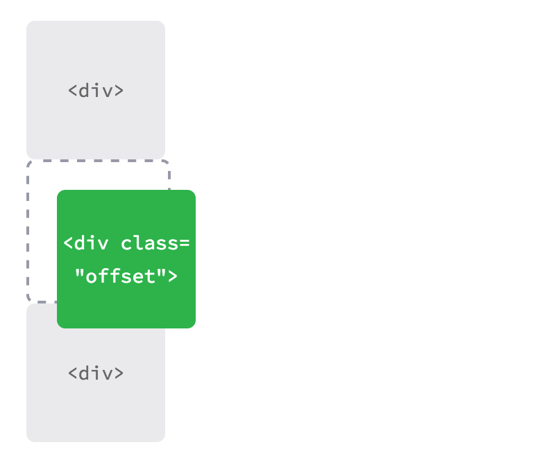
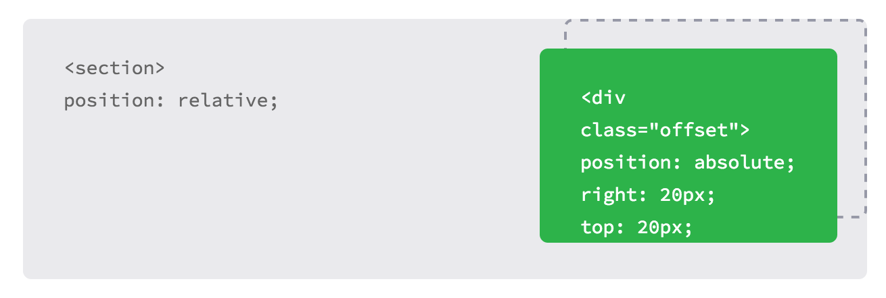

## Lesson 5

# Positioning

One of the best things about CSS is that it gives us the ability to position content and elements on a page in nearly any imaginable way, bringing structure to our designs and helping make content more digestible.

There are a few different types of positioning within CSS, and each has its own application. In this chapter we’re going to take a look at a few different use cases—creating reusable layouts and uniquely positioning one-off elements—and describe a few ways to go about each.

### Positioning with Floats
One way to position elements on a page is with the float property. The float property is pretty versatile and can be used in a number of different ways.

Essentially, the float property allows us to take an element, remove it from the normal flow of a page, and position it to the left or right of its parent element. All other elements on the page will then flow around the floated element. An **img** element floated to the side of a few paragraphs of text, for example, will allow the paragraphs to wrap around the image as necessary.

When the float property is used on multiple elements at the same time, it provides the ability to create a layout by floating elements directly next to or opposite each other, as seen in multiple-column layouts.

The float property accepts a few values; the two most popular values are left and right, which allow elements to be floated to the left or right of their parent element.

```
img {
  float: left;
}
```

### Floats in Practice
Let’s create a common page layout with a header at the top, two columns in the center, and a footer at the bottom. Ideally this page would be marked up using the **header**, **section**, **aside**, and **footer** elements as discussed in Lesson 2, “Know Your HTML.” Inside the **body** element, the HTML may look like this:

```
<header>...</header>
<section>...</section>
<aside>...</aside>
<footer>...</footer>
```


###Layout without Floats Demo
Here the **section** and **aside** elements, as block-level elements, will be stacked on top of one another by default. However, we want these elements to sit side by side. By floating the **section** to the left and the **aside** to the right, we can position them as two columns sitting opposite one another. Our CSS should look like this:

```
section {
  float: left;
}
aside {
  float: right;
}
```

For reference, when an element is floated, it will float all the way to the edge of its parent element. If there isn’t a parent element, the floated element will then float all the way to the edge of the page.

When we float an element, we take it out of the normal flow of the HTML document. This causes the width of that element to default to the width of the content within it. Sometimes, such as when we’re creating columns for a reusable layout, this behavior is not desired. It can be corrected by adding a fixed width property value to each column. Additionally, to prevent floated elements from touching one another, causing the content of one to sit directly next to the content of the other, we can use the margin property to create space between elements.

Here, we are extending the previous code block, adding a margin and width to each column to better shape our desired outcome.

```
section {
  float: left;
  margin: 0 1.5%;
  width: 63%;
}
aside {
  float: right;
  margin: 0 1.5%;
  width: 30%;
}
```

###Layout with Floats Demo
Floats May Change an Element’s Display Value

When floating an element, it is also important to recognize that an element is removed from the normal flow of a page, and that may change an element’s default display value. The float property relies on an element having a display value of block, and may alter an element’s default display value if it is not already displayed as a block-level element.

For example, an element with a display value of inline, such as the **span** inline-level element, ignores any height or width property values. However, should that inline-level element be floated, its display value will be changed to block, and it may then accept height or width property values.

As we float elements we must keep an eye on how their display property values are affected.

With two columns we can float one column to the left and another to the right, but with more columns we must change our approach. Say, for example, we’d like to have a row of three columns between our **header** and **footer** elements. If we drop our **aside** element and use three **section** elements, our HTML might look like this:

```
<header>...</header>
<section>...</section>
<section>...</section>
<section>...</section>
<footer>...</footer>
```

To position these three **section** elements in a three-column row, instead of floating one column to the left and one column to the right, we’ll float all three **section** elements to the left. We’ll also need to adjust the width of the **section** elements to account for the additional columns and to get them to sit one next to the other.

```
section {
  float: left;
  margin: 0 1.5%;
  width: 30%;
}
```

Here we have three columns, all with equal width and margin values and all floated to the left.


### Three-column Layout with Floats Demo

####Clearing & Containing Floats

The float property was originally designed to allow content to wrap around images. An image could be floated, and all of the content surrounding that image could then naturally flow around it. Although this works great for images, the float property was never actually intended to be used for layout and positioning purposes, and thus it comes with a few pitfalls.

One of those pitfalls is that occasionally the proper styles will not render on an element that it is sitting next to or is a parent element of a floated element. When an element is floated, it is taken out of the normal flow of the page, and, as a result, the styles of elements around that floated element can be negatively impacted.

Often margin and padding property values aren’t interpreted correctly, causing them to blend into the floated element; other properties can be affected, too.

Another pitfall is that sometimes unwanted content begins to wrap around a floated element. Removing an element from the flow of the document allows all the elements around the floated element to wrap and consume any available space around the floated element, which is often undesired.

With our previous two-column example, after we floated the **section** and **aside** elements, and before we set a width property value on either of them, the content within the **footer** element would have wrapped in between the two floated elements above it, filling in any available space. Consequently, the **footer** element would have sat in the gutter between the **section** and **aside** elements, consuming the available space.


#### Layout without Cleared or Contained Floats Demo

To prevent content from wrapping around floated elements, we need to clear, or contain, those floats and return the page to its normal flow. We’ll proceed by looking at how to clear floats, and then we’ll take a look at how to contain floats.

#### Clearing Floats

Clearing floats is accomplished using the clear property, which accepts a few different values: the most commonly used values being left, right, and both.

```
div {
  clear: left;
}
```

The left value will clear left floats, while the right value will clear right floats. The both value, however, will clear both left and right floats and is often the most ideal value.

Going back to our previous example, if we use the clear property with the value of both on the **footer** element, we are able to clear the floats. It is important that this clear be applied to an element appearing after the floated elements, not before, to return the page to its normal flow.

```
footer {
  clear: both;
}
```


### Layout with Cleared Floats Demo


#### Containing Floats

Rather than clearing floats, another option is to contain the floats. The outcomes of containing floats versus those of clearing them are nearly the same; however, containing floats does help to ensure that all of our styles will be rendered properly.

To contain floats, the floated elements must reside within a parent element. The parent element will act as a container, leaving the flow of the document completely normal outside of it. The CSS for that parent element, represented by the group class below, is shown here:

```
.group:before,
.group:after {
  content: "";
  display: table;
}
.group:after {
  clear: both;
}
.group {
  clear: both;
  *zoom: 1;
}
```

There’s quite a bit going on here, but essentially what the CSS is doing is clearing any floated elements within the element with the class of group and returning the flow of the document back to normal.

More specifically, the :before and :after pseudo-elements, as mentioned in the Lesson 4 exercise, are dynamically generated elements above and below the element with the class of group. Those elements do not include any content and are displayed as table-level elements, much like block-level elements. The dynamically generated element after the element with the class of group is clearing the floats within the element with the class of group, much like the clear from before. And lastly, the element with the class of group itself also clears any floats that may appear above it, in case a left or right float may exist. It also includes a little trickery to get older browsers to play nicely.

It is more code than the clear: both; declaration alone, but it can prove to be quite useful.

Looking at our two-column page layout from before, we could wrap the **section** and **aside** elements with a parent element. That parent element then needs to contain the floats within itself. The code would look like this:


HTML
```
<header>...</header>
<div class="group">
  <section>...</section>
  <aside>...</aside>
</div>
<footer>...</footer>
```

CSS
```
.group:before,
.group:after {
  content: "";
  display: table;
}
.group:after {
  clear: both;
}
.group {
  clear: both;
  *zoom: 1;
}
section {
  float: left;
  margin: 0 1.5%;
  width: 63%;
}
aside {
  float: right;
  margin: 0 1.5%;
  width: 30%;
}
```

### Layout with Contained Floats Demo

The technique shown here for containing elements is know as a “clearfix” and can often be found in other websites with the class name of clearfix or cf. We’ve chosen to use the class name of group, though, as it is representing a group of elements, and better expresses the content.

As elements are floated, it is important to keep note of how they affect the flow of a page and to make sure the flow of a page is reset by either clearing or containing the floats as necessary. Failing to keep track of floats can cause quite a few headaches, especially as pages begin to have multiple rows of multiple columns.

### Creating Reusable Layouts

When building a website, it is always best to write modular styles that may be reused elsewhere, and reusable layouts are high on the list of reusable code. Layouts can be created using either floats or inline-block elements, but which works best and why?

Whether it’s better to use floats or inline-block elements to lay out the structure of a page is open to debate. My approach is to use inline-block elements to create the grid—or layout—of a page and to then use floats when I want content to wrap around a given element (as floats were intended to do with images). Generally, I also find inline-block elements easier to work with.

That said, use whatever works best for you. If you are comfortable with one approach over the other, then go for it.

Currently there are new CSS specifications in the works—specifically flex- and grid- based properties—that will help address how to best lay out pages. Keep an eye out for these methods as they begin to surface.


### Uniquely Positioning Elements
Every now and then we’ll want to precisely position an element, but floats or inline-block elements won’t do the trick. Floats, which remove an element from the flow of a page, often produce unwanted results as surrounding elements flow around the floated element. Inline-block elements, unless we’re creating columns, can be fairly awkward to get into the proper position. For these situations we can use the position property in connection with box offset properties.

The position property identifies how an element is positioned on a page and whether or not it will appear within the normal flow of a document. This is used in conjunction with the box offset properties—top, right, bottom, and left—which identify exactly where an element will be positioned by moving elements in a number of different directions.

By default every element has a position value of static, which means that it exists in the normal flow of a document and it doesn’t accept any box offset properties. The static value is most commonly overwritten with a relative or absolute value, which we’ll examine next.

### Relative Positioning

The relative value for the position property allows elements to appear within the normal flow a page, leaving space for an element as intended while not allowing other elements to flow around it; however, it also allows an element’s display position to be modified with the box offset properties. For example, consider the following HTML and CSS:

HTML
```
<div>...</div>
<div class="offset">...</div>
<div>...</div>
```

CSS
```
div {
  height: 100px;
  width: 100px;
}
.offset {
  left: 20px;
  position: relative;
  top: 20px;
}
```



Here the second **div** element, the element with the class of offset, has a position value of relative and two box offset properties, left and top. This preserves the original position of the element, and other elements are not allowed to move into this space. Additionally, the box offset properties reposition the element, pushing it 20 pixels from the left and 20 pixels from the top of its original location.

With relatively positioned elements, it’s important to know that the box offset properties identify where an element will be moved from given its original position. Thus, the left property with a value of 20 pixels will actually push the element towards the right, from the left, 20 pixels. The top property with a value of 20 pixels, then, will push an element towards the bottom, from the top, 20 pixels.

When we position the element using the box offset properties, the element overlaps the element below it rather than moving that element down as the margin or padding properties would.


### Absolute Positioning

The absolute value for the position property is different from the relative value in that an element with a position value of absolute will not appear within the normal flow of a document, and the original space and position of the absolutely positioned element will not be preserved.

Additionally, absolutely positioned elements are moved in relation to their closest relatively positioned parent element. Should a relatively positioned parent element not exist, the absolutely positioned element will be positioned in relation to the <body> element. That’s quite a bit of information; let’s take a look at how this works inside some code:

HTML
```
<section>
  <div class="offset">...</div>
</section>
```

CSS
```
section {
  position: relative;
}
div {
  position: absolute;
  right: 20px;
  top: 20px;
}
```


In this example the **section** element is relatively positioned but doesn’t include any box offset properties. Consequently its position doesn’t change. The **div** element with a class of offset includes a position value of absolute. Because the **section** element is the closest relatively positioned parent element to the **div** element, the **div** element will be positioned in relation to the **section** element.

With relatively positioned elements, the box offset properties identify in which direction an element would be moved in relation to itself. With absolutely positioned elements, the box offset properties identify in which direction an element will be moved in relation to its closest relatively positioned parent element.

As a result of the right and top box offset properties, the **div** element will appear 20 pixels from the right and 20 pixels from the top of the **section**.

Because the **div** element is absolutely positioned, it does not sit within the normal flow of the page and will overlap any surrounding elements. Additionally, the original position of the **div** is not preserved, and other elements are able to occupy that space.

Typically, most positioning can be handled without the use of the position property and box offset properties, but in certain cases they can be extremely helpful.

To know more about positioning of blocks you can follow this link [here]( http://alistapart.com/article/css-positioning-101)


##Exercise

Complete this exercise on codeacademy  - https://www.codecademy.com/courses/intro-to-css-positioning/0/1
