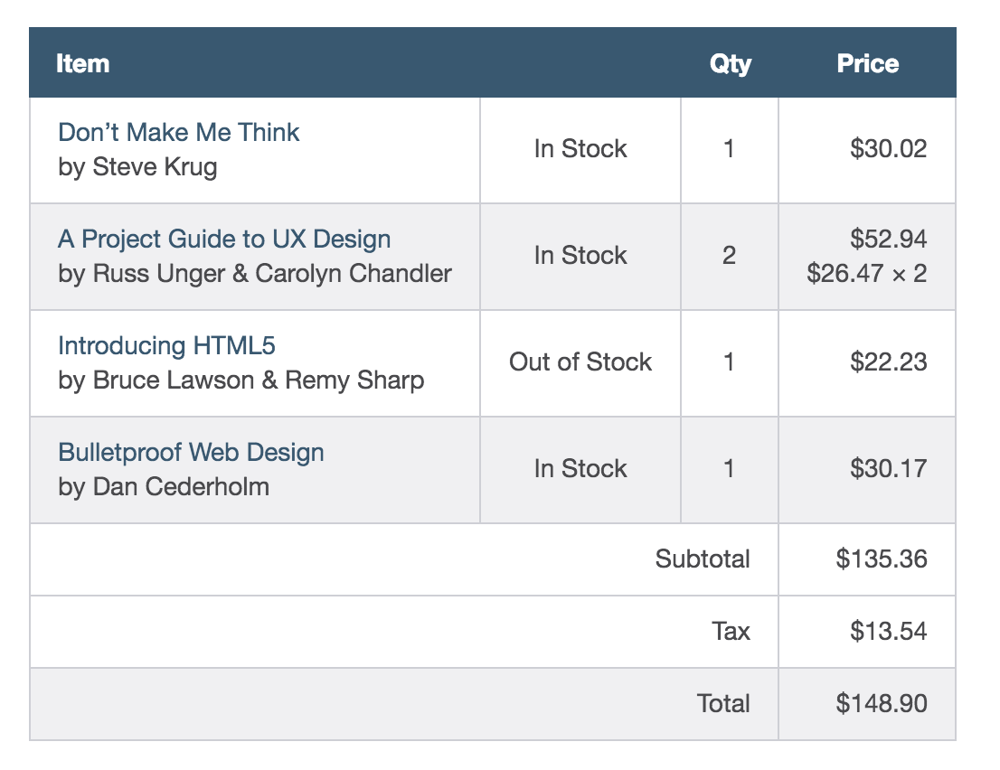
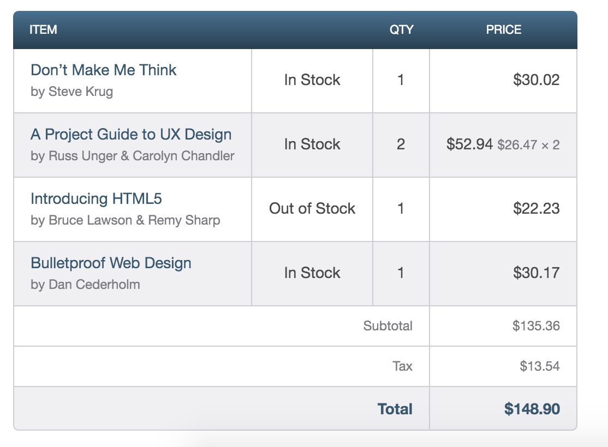

# Tables

HTML tables were created to provide a straightforward way to mark up structured tabular data and to display that data in a form that is easy for users to read and digest.

When HTML was being developed, however, CSS was not widely supported in browsers, so tables were the primary means by which websites were built. They were used for positioning content as well as for building the overall layout of a page. This worked at the time, but it was not what table markup was intended for, and it led to many other associated problems.

Fortunately, we have come a long way since then. Today tables are used specifically for organizing data (like they should be), and CSS is free to get on with the jobs of positioning and layout.

Building data tables still has its challenges. How a table should be built in HTML depends largely on the data and how it is to be displayed. Then, once they’re marked up in HTML, tables need to be styled with CSS to make the information more legible and understandable to users.

### Creating a Table
Tables are made up of data that is contained within columns and rows, and HTML supplies several different elements for defining and structuring these items. At a minimum a table must consist of **table**, **tr** (table row), and **td** (table data) elements. For greater structure and additional semantic value, tables may include the **th** (table header) ele- ment and a few other elements as well. When all of these elements are working together, they produce a solid table.

###Table

We use the **table** element to initialize a table on a page. Using the **table** element signifies that the information within this element will be tabular data displayed in the necessary columns and rows.

```
<table>
  ...
</table>
```

###Table Row

Once a table has been defined in HTML, table rows may be added using the **tr** element. A table can have numerous table rows, or **tr** elements. Depending on the amount of information there is to display, the number of table rows may be substantial.

```
<table>
  <tr>
    ...
  </tr>
  <tr>
    ...
  </tr>
</table>
```

###Table Data

Once a table is defined and rows within that table have been set up, data cells may be added to the table via the table data, or **td**, element. Listing multiple **td** elements one after the other will create columns within a table row.

```
<table>
  <tr>
    <td>Don&#8217;t Make Me Think by Steve Krug</td>
    <td>In Stock</td>
    <td>1</td>
    <td>$30.02</td>
  </tr>
  <tr>
    <td>A Project Guide to UX Design by Russ Unger &#38; Carolyn Chandler</td>
    <td>In Stock</td>
    <td>2</td>
    <td>$52.94 ($26.47 &#215; 2)</td>
  </tr>
  <tr>
    <td>Introducing HTML5 by Bruce Lawson &#38; Remy Sharp</td>
    <td>Out of Stock</td>
    <td>1</td>
    <td>$22.23</td>
  </tr>
  <tr>
    <td>Bulletproof Web Design by Dan Cederholm</td>
    <td>In Stock</td>
    <td>1</td>
    <td>$30.17</td>
  </tr>
</table>
```

### Table Header

To designate a heading for a column or row of cells, the table header element, **th**, should be used. The **th** element works just like the **td** element in that it creates a cell for data. The value to using the **th** element over the **td** element is that the table header element provides semantic value by signifying that the data within the cell is a heading, while the **td** element only represents a generic piece of data.

The difference between the two elements is similar to the difference between headings ( **h1** through **h6** elements) and paragraphs ( **p** elements). While a heading’s content could be placed within a paragraph, it doesn’t make sense to do so. Specifically using a heading adds more semantic value to the content. The same is true for table headers.

Table headers may be used within both columns and rows; the data within a table determines where the headers are appropriate. The scope attribute helps to identify exactly what content a table header relates to. The scope attribute indicates with the values col, row, colgroup, and rowgroup whether a table header applies to a row or column. The most commonly used values are col and row. The col value indicates that every cell within the column relates directly to that table header, and the row value indicates that every cell within the row relates directly to that table header.

Using the **th** element, along with the scope attribute, tremendously helps screen readers and assistive technologies make sense of a table. Therefore, they are also beneficial to those browsing a web page using those technologies.

Additionally, depending on the browser, table headers may receive some default styling, usually bold and centered.

```
<table>
  <tr>
    <th scope="col">Item</th>
    <th scope="col">Availability</th>
    <th scope="col">Qty</th>
    <th scope="col">Price</th>
  </tr>
  <tr>
    <td>Don&#8217;t Make Me Think by Steve Krug</td>
    <td>In Stock</td>
    <td>1</td>
    <td>$30.02</td>
  </tr>
  <tr>
    <td>A Project Guide to UX Design by Russ Unger &#38; Carolyn Chandler</td>
    <td>In Stock</td>
    <td>2</td>
    <td>$52.94 ($26.47 &#215; 2)</td>
  </tr>
  <tr>
    <td>Introducing HTML5 by Bruce Lawson &#38; Remy Sharp</td>
    <td>Out of Stock</td>
    <td>1</td>
    <td>$22.23</td>
  </tr>
  <tr>
    <td>Bulletproof Web Design by Dan Cederholm</td>
    <td>In Stock</td>
    <td>1</td>
    <td>$30.17</td>
  </tr>
</table>
```

Getting data into a table is only the beginning. While we’ve scratched the surface of how to semantically add data to a table, there is more we can do to define the structure of our tables.

### Table Structure
Knowing how to build a table and arrange data is extremely powerful; however, there are a few additional elements to help us organize the data and structure of a table. These elements include **caption**, **thead**, **tbody**, and **tfoot**.

#### Table Caption

The **caption** element provides a caption or title for a table. A caption will help users identify what the table pertains to and what data they can expect to find within it. The **caption** element must come immediately after the opening **table** tag, and it is positioned at the top of a table by default.

```
<table>
  <caption>Design and Front-End Development Books</caption>
  ...
</table>
```

#### Table Head, Body, & Foot

The content within tables can be broken up into multiple groups, including a head, a body, and a foot. The **thead** (table head), **tbody** (table body), and **tfoot** (table foot) elements help to structurally organize tables.

The table head element, **thead**, wraps the heading row or rows of a table to denote the head. The table head should be placed at the top of a table, after any **caption** element and before any **tbody** element.

After the table head may come either the **tbody** or **tfoot** elements. Originally the **tfoot** element had to come immediately after the **thead** element, but HTML5 has provided leeway here. These elements may now occur in any order so long as they are never parent elements of one another. The **tbody** element should contain the primary data within a table, while the **tfoot** element contains data that outlines the contents of a table.

```
<table>
  <caption>Design and Front-End Development Books</caption>
  <thead>
    <tr>
      <th scope="col">Item</th>
      <th scope="col">Availability</th>
      <th scope="col">Qty</th>
      <th scope="col">Price</th>
    </tr>
  </thead>
  <tbody>
    <tr>
      <td>Don&#8217;t Make Me Think by Steve Krug</td>
      <td>In Stock</td>
      <td>1</td>
      <td>$30.02</td>
    </tr>
    ...
  </tbody>
  <tfoot>
    <tr>
      <td>Subtotal</td>
      <td></td>
      <td></td>
      <td>$135.36</td>
    </tr>
    <tr>
      <td>Tax</td>
      <td></td>
      <td></td>
      <td>$13.54</td>
    </tr>
    <tr>
      <td>Total</td>
      <td></td>
      <td></td>
      <td>$148.90</td>
    </tr>
  </tfoot>
</table>
```

### Combining Multiple Cells

Often, two or more cells need to be combined into one without breaking the overall row and column layout. Perhaps two cells next to each other contain the same data, there’s an empty cell, or the cells should be combined for styling purposes. In these cases we can use the colspan and rowspan attributes. These two attributes work on either the **td** or **th** elements.

The colspan attribute is used to span a single cell across multiple columns within a table, while the rowspan attribute is used to span a single cell across multiple rows. Each attribute accepts an integer value that indicates the number of cells to span across, with 1 being the default value.

Using the table of books from before, we can now remove the empty table cells within the table footer as well as clean up the table header.

```
<table>
  <caption>Design and Front-End Development Books</caption>
  <thead>
    <tr>
      <th scope="col" colspan="2">Item</th>
      <th scope="col">Qty</th>
      <th scope="col">Price</th>
    </tr>
  </thead>
  <tbody>
    <tr>
      <td>Don&#8217;t Make Me Think by Steve Krug</td>
      <td>In Stock</td>
      <td>1</td>
      <td>$30.02</td>
    </tr>
    ...
  </tbody>
  <tfoot>
    <tr>
      <td colspan="3">Subtotal</td>
      <td>$135.36</td>
    </tr>
    <tr>
      <td colspan="3">Tax</td>
      <td>$13.54</td>
    </tr>
    <tr>
      <td colspan="3">Total</td>
      <td>$148.90</td>
    </tr>
  </tfoot>
</table>
```

###Table Borders
Effective use of borders can help make tables more comprehensible. Borders around a table or individual cells can make a large impact when a user is trying to interpret data and quickly scan for information. When styling table borders with CSS there are two properties that will quickly come in handy: border-collapse and border-spacing.

####Border Collapse Property

Tables consist of a parent **table** element as well as nested **th** or **td** elements. When we apply borders around these elements those borders will begin to stack up, with the border of one element sitting next to that of another element. For example, if we put a 2-pixel border around an entire table and then an additional 2-pixel border around each table cell, there would be a 4-pixel border around every cell in the table.

The border-collapse property determines a table’s border model. There are three values for the border-collapse property: collapse, separate, and inherit. By default, the border-collapse property value is separate, meaning that all of the different borders will stack up next to one another, as described above. The collapse property, on the other hand, condenses the borders into one, choosing the table cell as the primary border.

```
table {
  border-collapse: collapse;
}
th,
td {
  border: 1px solid #cecfd5;
  padding: 10px 15px;
}
```

####Border Spacing Property

As the border-collapse property with the separate value allows borders to be stacked up against one another, the border-spacing property can determine how much space, if any, appears between the borders.

For example, a table with a 1-pixel border around the entire table and a 1-pixel border around each cell will have a 2-pixel border all around every cell because the borders stack up next to one another. Adding in a border-spacing value of 4 pixels separates the borders by 4 pixels.

```
table {
  border-collapse: separate;
  border-spacing: 4px;
}
table,
th,
td {
  border: 1px solid #cecfd5;
}
th,
td {
  padding: 10px 15px;
}
```
The border-spacing property works only when the border-collapse property value is separate, its default value. If the border-collapse property hasn’t been previously used, we can use the border-spacing property without worry.

Additionally, the border-spacing property may accept two length values: the first value for horizontal spacing and the second value for vertical spacing. The declaration border-spacing: 5px 10px;, for example, will place 5 pixels of horizontal spacing between borders and 10 pixels of vertical spacing between borders.

####Adding Borders to Rows

Adding borders to a table can be tricky at times, particularly when putting borders between rows. Within a table, borders cannot be applied to **tr** elements or table structural elements, so when we want to put a border between rows some thought is required.

We’ll begin by making sure the table’s border-collapse property value is set to collapse, and then we’ll add a bottom border to each table cell, regardless of whether it’s a **th** or **td** element. If we wish, we can remove the bottom border from the cells within the last row of the table by using the :last-child pseudo-class selector to select the last **tr** element within the table and target the **td** elements within that row. Additionally, if a table is using the structural elements, we’ll want to make sure to prequalify the last row of the table as being within the **tfoot** element.

```
table {
  border-collapse: collapse;
}
th,
td {
  border-bottom: 1px solid #cecfd5;
  padding: 10px 15px;
}
tfoot tr:last-child td {
  border-bottom: 0;
}
```

### Table Striping
In the effort to make tables more legible, one common design practice is to “stripe” table rows with alternating background colors. This makes the rows clearer and provides a visual cue for scanning information. One way to do this is to place a class on every other **tr** element and set a background color to that class. Another, easier way is to use the :nth-child pseudo-class selector with an even or odd argument to select every other **tr** element.

Here, our table of books uses the :nth-child pseudo-class selector with an even argument to select all even table rows within the table and apply a gray background. Consequently, every other row within the table body is gray.

```
table {
  border-collapse: separate;
  border-spacing: 0;
}
th,
td {
  padding: 10px 15px;
}
thead {
  background: #395870;
  color: #fff;
}
tbody tr:nth-child(even) {
  background: #f0f0f2;
}
td {
  border-bottom: 1px solid #cecfd5;
  border-right: 1px solid #cecfd5;
}
td:first-child {
  border-left: 1px solid #cecfd5;
}
```



Within this code there are a few intricacies worth mentioning. To begin, the <table> element has an explicit border-collapse property set to separate and a border-spacing property set to 0. The reason for this is that the <td> elements include borders, while the <th> elements do not. Without the border-collapse property set to separate the borders of the <td> elements would make the body and foot of the table wider than the head.

Since the border-collapse property is set to separate we need to be careful as to how borders are applied to <td> elements. Here borders are set to the right and bottom of all <td> elements. Then, the very first <td> element within a <tr> element will receive a left border. As all of the <td> elements stack together so do their borders, providing the appearance of a solid border around each element.

Lastly, all <th> elements receive a blue background, and every even <tr> element receives a gray background by way of the :nth-child pseudo-class selector.

Aligning Text
In addition to table borders and striping, the alignment of text within cells, both horizontal and vertical, plays an integral role in table formatting. Names, descriptions, and so forth are commonly flush left, while numbers and other figures are flush right. Other information, depending on its context, may be centered. We can move text horizontally using the text-align property in CSS, as we covered in Lesson 6, “Working with Typography.”

To align text vertically, however, the vertical-align property is used. The vertical-align property works only with inline and table-cell elements—it won’t work for block, inline-block, or any other element levels.

The vertical-align property accepts a handful of different values; the most popular values are top, middle, and bottom. These values vertically position text in relation to the table cell, for table-cell elements, or to the closest parent element, for inline-level elements.

By revising the HTML and CSS to include the text-align and vertical-align properties, we can clean up the layout of our table of books. Note that the data within the table becomes much clearer and more digestible.

HTML
```
<table>
  <thead>
    <tr>
      <th scope="col" colspan="2">Item</th>
      <th scope="col">Qty</th>
      <th scope="col">Price</th>
    </tr>
  </thead>
  <tbody>
    <tr>
      <td>
        <strong class="book-title">Don&#8217;t Make Me Think</strong> by Steve Krug
      </td>
      <td class="item-stock">In Stock</td>
      <td class="item-qty">1</td>
      <td class="item-price">$30.02</td>
    </tr>
    <tr>
      <td>
        <strong class="book-title">A Project Guide to UX Design</strong> by Russ Unger &#38; Carolyn Chandler
      </td>
      <td class="item-stock">In Stock</td>
      <td class="item-qty">2</td>
      <td class="item-price">$52.94 <span class="item-multiple">$26.47 &#215; 2</span></td>
    </tr>
    <tr>
      <td>
        <strong class="book-title">Introducing HTML5</strong> by Bruce Lawson &#38; Remy Sharp
      </td>
      <td class="item-stock">Out of Stock</td>
      <td class="item-qty">1</td>
      <td class="item-price">$22.23</td>
    </tr>
    <tr>
      <td>
        <strong class="book-title">Bulletproof Web Design</strong> by Dan Cederholm
      </td>
      <td class="item-stock">In Stock</td>
      <td class="item-qty">1</td>
      <td class="item-price">$30.17</td>
    </tr>
  </tbody>
  <tfoot>
    <tr>
      <td colspan="3">Subtotal</td>
      <td>$135.36</td>
    </tr>
    <tr>
      <td colspan="3">Tax</td>
      <td>$13.54</td>
    </tr>
    <tr>
      <td colspan="3">Total</td>
      <td>$148.90</td>
    </tr>
  </tfoot>
</table>
```

CSS
```
table {
  border-collapse: separate;
  border-spacing: 0;
  color: #4a4a4d;
  font: 14px/1.4 "Helvetica Neue", Helvetica, Arial, sans-serif;
}
th,
td {
  padding: 10px 15px;
  vertical-align: middle;
}
thead {
  background: #395870;
  color: #fff;
}
th:first-child {
  text-align: left;
}
tbody tr:nth-child(even) {
  background: #f0f0f2;
}
td {
  border-bottom: 1px solid #cecfd5;
  border-right: 1px solid #cecfd5;
}
td:first-child {
  border-left: 1px solid #cecfd5;
}
.book-title {
  color: #395870;
  display: block;
}
.item-stock,
.item-qty {
  text-align: center;
}
.item-price {
  text-align: right;
}
.item-multiple {
  display: block;
}
tfoot {
  text-align: right;
}
tfoot tr:last-child {
  background: #f0f0f2;
}
```

###Completely Styled Table
So far our table of books is looking pretty good. Let’s take it one step further by rounding some corners and styling some of the text just a little more.

HTML
```
<table>
  <thead>
    <tr>
      <th scope="col" colspan="2">Item</th>
      <th scope="col">Qty</th>
      <th scope="col">Price</th>
    </tr>
  </thead>
  <tbody>
    <tr>
      <td>
        <strong class="book-title">Don&#8217;t Make Me Think</strong>
        <span class="text-offset">by Steve Krug</span>
      </td>
      <td class="item-stock">In Stock</td>
      <td class="item-qty">1</td>
      <td class="item-price">$30.02</td>
    </tr>
    <tr>
      <td>
        <strong class="book-title">A Project Guide to UX Design</strong>
        <span class="text-offset">by Russ Unger &#38; Carolyn Chandler</span>
      </td>
      <td class="item-stock">In Stock</td>
      <td class="item-qty">2</td>
      <td class="item-price">$52.94 <span class="text-offset item- multiple">$26.47 &#215; 2</span></td>
    </tr>
    <tr>
      <td>
        <strong class="book-title">Introducing HTML5</strong>
        <span class="text-offset">by Bruce Lawson &#38; Remy Sharp</span>
      </td>
      <td class="item-stock">Out of Stock</td>
      <td class="item-qty">1</td>
      <td class="item-price">$22.23</td>
    </tr>
    <tr>
      <td>
        <strong class="book-title">Bulletproof Web Design</strong>
        <span class="text-offset">by Dan Cederholm</span>
      </td>
      <td class="item-stock">In Stock</td>
      <td class="item-qty">1</td>
      <td class="item-price">$30.17</td>
    </tr>
  </tbody>
  <tfoot>
    <tr class="text-offset">
      <td colspan="3">Subtotal</td>
      <td>$135.36</td>
    </tr>
    <tr class="text-offset">
      <td colspan="3">Tax</td>
      <td>$13.54</td>
    </tr>
    <tr>
      <td colspan="3">Total</td>
      <td>$148.90</td>
    </tr>
  </tfoot>
</table>
```

CSS
```
table {
  border-collapse: separate;
  border-spacing: 0;
  color: #4a4a4d;
  font: 14px/1.4 "Helvetica Neue", Helvetica, Arial, sans-serif;
}
th,
td {
  padding: 10px 15px;
  vertical-align: middle;
}
thead {
  background: #395870;
  background: linear-gradient(#49708f, #293f50);
  color: #fff;
  font-size: 11px;
  text-transform: uppercase;
}
th:first-child {
  border-top-left-radius: 5px;
  text-align: left;
}
th:last-child {
  border-top-right-radius: 5px;
}
tbody tr:nth-child(even) {
  background: #f0f0f2;
}
td {
  border-bottom: 1px solid #cecfd5;
  border-right: 1px solid #cecfd5;
}
td:first-child {
  border-left: 1px solid #cecfd5;
}
.book-title {
  color: #395870;
  display: block;
}
.text-offset {
  color: #7c7c80;
  font-size: 12px;
}
.item-stock,
.item-qty {
  text-align: center;
}
.item-price {
  text-align: right;
}
.item-multiple {
  display: block;
}
tfoot {
  text-align: right;
}
tfoot tr:last-child {
  background: #f0f0f2;
  color: #395870;
  font-weight: bold;
}
tfoot tr:last-child td:first-child {
  border-bottom-left-radius: 5px;
}
tfoot tr:last-child td:last-child {
  border-bottom-right-radius: 5px;
}
```



## Exercise
Create the table as per the image given below, both html and css.
